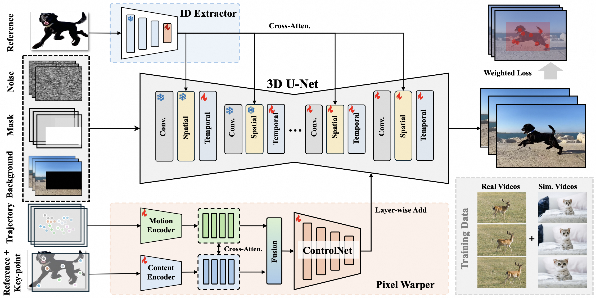

<p align="center">

  <h2 align="center">VideoAnydoor : High-fidelity Video Object Insertion with Precise Motion Control</h2>
  <p align="center">
    <a href=""><strong>Yuanpeng Tu</strong></a>
    ·
    <a href="https://scholar.google.com/citations?user=7QvWnzMAAAAJ&hl=zh-CN"><strong>Hao Luo</strong></a>
    ·
    <a href="https://xavierchen34.github.io/"><strong>Xi Chen</strong></a>
    ·
    <a href="https://sihuiji.github.io/"><strong>Sihui Ji</strong></a>
    ·
    <a href="https://scholar.google.com/citations?user=UeltiQ4AAAAJ&hl=en"><strong>Xiang Bai</strong></a>
    <br>
    <a href="https://hszhao.github.io/"><strong>Hengshuang Zhao</strong></a><sup>†</sup>
    <br>
    <br>
        <a href="https://arxiv.org/pdf/2501.01427"></a>
        <a href='https://videoanydoor.github.io/'></a>
        <!-- <a href='https://mp.weixin.qq.com/s/vDR4kPLqnCUwfPiBNKKV9A'></a> -->
        <!-- <a href='https://huggingface.co/Shuaishuai0219/Animate-X'></a> -->
    <br>
    <b></a>HKU &nbsp; | &nbsp; </a> Alibaba DAMO Academy &nbsp; | &nbsp; </a> Hupan Lab &nbsp; | &nbsp; </a> HUST</b>
    <br>
  </p>
</p>

This repository is the official implementation of paper "VideoAnydoor : High-fidelity Video Object Insertion with Precise Motion Control". It can insert/replace diverse objects into the videos with precise motion alignment with the given motion trajectories, where the appearance details of the reference object can be accurately preserved as well.
  <table align="center">
    <tr>
    <td>
      
    </td>
    </tr>
  </table>


## &#x1F4CC; Updates
* [2025.1.1] 🔥 Our [paper](https://arxiv.org/pdf/2506.09995) is in public on arxiv.
* [2025.3.15] 🔥 Our [paper](https://arxiv.org/pdf/2506.09995) is accepted by SIGGRAPH 2025.
* [2025.6.12] 🔥 We are now organizing the source code and will release it recently. Sorry for the delay.


### Introduction of VideoAnydoor

<table class="center">
<tr>
    <td width=100% style="border: none">
        <video controls loop src="https://github.com/user-attachments/assets/190f88c4-97e1-4767-bf6b-3ce59059fd9a" muted="false"></video>
    </td>
</tr>
</table>

### Visualization


<table class="center">
<tr>
    <td width=100% style="border: none">
        <video controls loop src="https://github.com/user-attachments/assets/4befa175-0e5e-48e1-9d2e-9d97d080644b" muted="false"></video>
    </td>
</tr>
</table>

### More Applications

<table class="center">
<tr>
    <td width=100% style="border: none">
        <video controls loop src="https://github.com/user-attachments/assets/bcb8d0f5-a9f5-4077-86ba-068e889d38be" muted="false"></video>
    </td>
</tr>
</table>


## &#x1F4E7; Acknowledgement
Our implementation is based on [Wanx](https://github.com/modelscope/DiffSynth-Studio). Thanks for their remarkable contribution and released code! If we missed any open-source projects or related articles, we would like to complement the acknowledgement of this specific work immediately.

## &#x2696; License
This repository is released under the Apache-2.0 license as found in the [LICENSE](LICENSE) file.

## &#x1F4DA; Citation
If you find this codebase useful for your research, please use the following entry.
```BibTeX
@misc{tu2025videoanydoorhighfidelityvideoobject,
      title={VideoAnydoor: High-fidelity Video Object Insertion with Precise Motion Control}, 
      author={Yuanpeng Tu and Hao Luo and Xi Chen and Sihui Ji and Xiang Bai and Hengshuang Zhao},
      year={2025},
      journal={arXiv preprint arXiv:2501.01427}, 
}
        

```
